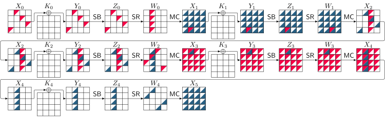
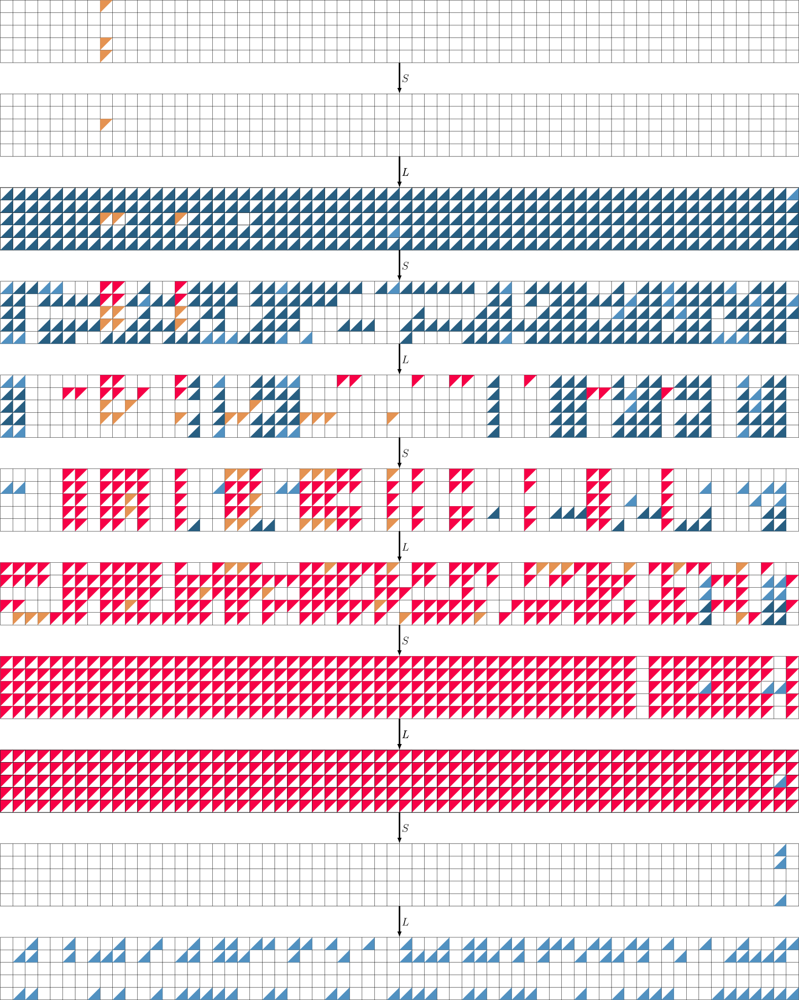
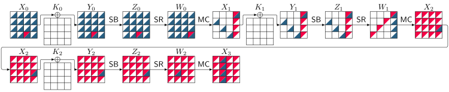
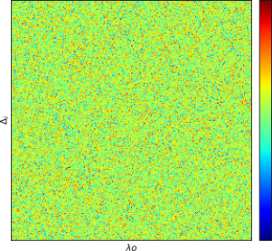

# Revisiting Differential-Linear Attacks via a Boomerang Perspective 
<p align="center">
  
  
  
  
  
  
    
</p>

This repository hosts the source code for the tools presented in our paper, accepted at [CRYPTO 2024](https://crypto.iacr.org/2024/), titled:  
[**Revisiting Differential-Linear Attacks via a Boomerang Perspective with Application to AES, Ascon, CLEFIA, SKINNY, PRESENT, KNOT, TWINE, WARP, LBlock, Simeck, and SERPENT**](https://ia.cr/2024/255).

## Table of Contents

- [Required Software](#required-software)
- [Installation](#installation)
  - [Method 1](#method-1)
  - [Method 2](#method-2)
- [Structure of Our Tool](#structure-of-our-tool)
- [Usage](#usage)
  - [Example 1: TWINE](#example-1-twine)
  - [Example 2: WARP](#example-2-warp)
  - [Example 3: AES](#example-3-aes)
  - [Example 4: Ascon](#example-4-ascon)
- [Analytical Estimations](#analytical-estimations)
  - [Example 1: 8 Rounds of TWINE (Basic)](#example-1-8-rounds-of-twine-basic)
  - [Example 2: 3 Rounds of AES (Medium)](#example-2-3-rounds-of-aes-medium)
  - [Example 3: 9 Rounds of TWINE (Medium)](#example-3-9-rounds-of-twine-medium)
  - [Example 4: 10 Rounds of TWINE (Complex)](#example-4-10-rounds-of-twine-complex)
- [Experimental Verification](#experimental-verification)
  - [Example 1: AES](#example-1-aes)
  - [Example 2: TWINE](#example-2-twine)
  - [Example 3: Ascon](#example-3-ascon)
  - [Example 4: WARP](#example-4-warp)
- [Encoding S-boxes and Other Building Block Functions](#encoding-s-boxes-and-other-building-block-functions)
- [Verifying Proposition 2](#verifying-proposition-2)
- [References](#references)
- [Citation](#citation)
- [License](#license)

## Required Software

To use our tool effectively, ensure the following software is installed:

- [**MiniZinc**](https://www.minizinc.org/): Used to compile and solve CP models.
- [**latexmk**](https://www.latex-project.org/): Builds `.tex` files and generates visualizations of attack shapes (alternatively, you can directly use `lualatex`).
- [**Or-Tools**](https://developers.google.com/optimization): Solves CP/MILP models.
- [**Gurobi**](https://www.gurobi.com/downloads/gurobi-software/): Solves CP/MILP models (requires a license).
- [**SageMath**](https://www.sagemath.org/): Executes analytical formulas.

**Note:**  
- The identification of distinguishers relies solely on MiniZinc, Or-Tools, and Gurobi.  
- SageMath is required only for running analytical estimations.

## Installation

### Method 1

In this method, we provide a Docker file that contains all the necessary software to run our tool (except for Gurobi). 
To build the Docker image, navigate to the [docker](docker) directory and run the following command:

```bash
sudo docker build -f Dockerfile -t dl .
```

Note that Gurboi is not included in the Docker image, as downloading it requires an account on the Gurobi website, and it also requires a license. To install Gurobi, please follow the instructions provided [here](https://www.gurobi.com/documentation/9.1/quickstart_linux/software_installation_guid.html).
After building the Docker image, you can run the Docker container using the following command:

```bash
docker run --rm -it dl
```

### Method 2

In this method, we provide a script that installs all the necessary software to run our tool (except for Gurobi).

Several Constraint Programming (CP) solvers come pre-packaged with MiniZinc, requiring no additional installation steps. 
We use Or-Tools as one of the CP solvers. 
Fortunately, `OR Tools CP-SAT` is bundled with MiniZinc after version 2.8.0. 
Thus, by installing the latest version of MiniZinc, one can use `OR Tools CP-SAT` without any further installation.
Additionally, we need the Python package named `minizinc` to work with MiniZinc in Python. 
To install MiniZinc and required Python packages in Ubuntu, one can use the following commands:

```bash
#!/bin/bash

# Update and upgrade system packages
sudo apt update -y
sudo apt upgrade -y

# Install system dependencies
sudo apt install -y python3-full python3-pip python3-venv git wget curl

# Create a working directory
mkdir -p "$HOME/minizinc_install"
cd "$HOME/minizinc_install"

# Download and extract the latest MiniZinc release
LATEST_MINIZINC_VERSION=$(curl -s https://api.github.com/repos/MiniZinc/MiniZincIDE/releases/latest | grep -oP '"tag_name": "\K(.*)(?=")')
wget "https://github.com/MiniZinc/MiniZincIDE/releases/download/$LATEST_MINIZINC_VERSION/MiniZincIDE-$LATEST_MINIZINC_VERSION-bundle-linux-x86_64.tgz"
tar -xvzf MiniZincIDE-$LATEST_MINIZINC_VERSION-bundle-linux-x86_64.tgz
mv MiniZincIDE-$LATEST_MINIZINC_VERSION-bundle-linux-x86_64 "$HOME/minizinc"
rm MiniZincIDE-$LATEST_MINIZINC_VERSION-bundle-linux-x86_64.tgz

# Add MiniZinc to system PATH
sudo ln -sf "$HOME/minizinc/bin/minizinc" /usr/local/bin/minizinc

# Create a Python virtual environment
python3 -m venv "$HOME/minizinc_venv"
source "$HOME/minizinc_venv/bin/activate"

# Install Python packages
pip install --upgrade pip
pip install minizinc
pip install sagemath  # Note: this is not the full SageMath system
```
### Installing Gurobi and `gurobipy`

To solve CP models using Gurobi, you need to install its Python interface, `gurobipy`. You can do this by running the following command:

```bash
python3 -m pip install gurobipy
```

For detailed instructions on installing Gurobi and obtaining an academic license, refer to the [GrabGurobi repository](https://github.com/hadipourh/grabgurobi).

## Structure of Our Tool
We have developed our tools using a modular approach to ensure flexibility and maintainability. The workflow is divided into three main modules:

1. **Model Creation**: Generates CP/MILP models tailored for each application.
2. **Solver Integration**: Calls the solver, processes the results, and extracts meaningful insights.
3. **Visualization**: Produces visual representations of the outcomes.

The core idea is to first generate a CP/MILP model for a specific application and then solve it using a CP/MILP solver. We employ two distinct approaches for model creation based on the solver being used:

- **Or-Tools Solver**:  
  - The CP model is created in the `.mzn` format using the MiniZinc language.  
  - The Python interface of Or-Tools is used to solve the model and process the results.

- **Gurobi Solver**:  
  - The MILP model is created in the `.lp` format using the Python interface.  
  - The Python interface of Gurobi is then used to solve the model and process the results.

The key difference between these approaches lies in the model creation process. For `.mzn` files, the CP model is directly written in the MiniZinc language without relying on Python for model generation.

## Usage

Using our tool is simple and efficient. Specify the number of attacked rounds or the distinguisher's length, and choose the solver. The tool will automatically identify the distinguisher and generate a visualization of its shape.

For a quick reference on how to use the tool for each application, execute the following command:

```bash
python3 <application_name>.py --help
```

We give a few examples, but the same applies to other applications. 

### Example 1: TWINE

To discover distinguishers for TWINE, begin by navigating into [twine](twine) directory. 
Let us assume we aim to find a distinguisher for 16 rounds of TWINE, with the lengths of the upper, middle, and lower parts of the distinguisher set to `(RU, RM, RL) = (3, 10, 3)`. 
We can then employ the following command to identify the distinguisher:

```bash
python3 attack.py -RU 3 -RM 10 -RL 3
```

The subsequent field illustrates a portion of the terminal output from the preceding command:

```
Academic license - for non-commercial use only - expires 2024-06-10
Read LP format model from file warp_3_10_3.lp
Reading time = 0.00 seconds
: 1074 rows, 528 columns, 2560 nonzeros
Gurobi Optimizer version 10.0.1 build v10.0.1rc0 (linux64)

CPU model: 11th Gen Intel(R) Core(TM) i7-1165G7 @ 2.80GHz, instruction set [SSE2|AVX|AVX2|AVX512]
Thread count: 4 physical cores, 8 logical processors, using up to 8 threads

Optimize a model with 1074 rows, 528 columns and 2560 nonzeros
Model fingerprint: 0x4005271d
Variable types: 0 continuous, 528 integer (528 binary)
Coefficient statistics:
  Matrix range     [1e+00, 1e+00]
  Objective range  [2e+00, 4e+00]
  Bounds range     [1e+00, 1e+00]
  RHS range        [1e+00, 1e+00]
Found heuristic solution: objective 352.0000000
Presolve removed 625 rows and 328 columns
Presolve time: 0.01s
Presolved: 449 rows, 200 columns, 1152 nonzeros
Variable types: 0 continuous, 200 integer (200 binary)
Found heuristic solution: objective 256.0000000

Root relaxation: objective 9.872727e+00, 191 iterations, 0.00 seconds (0.00 work units)

    Nodes    |    Current Node    |     Objective Bounds      |     Work
 Expl Unexpl |  Obj  Depth IntInf | Incumbent    BestBd   Gap | It/Node Time

     0     0    9.87273    0  151  256.00000    9.87273  96.1%     -    0s
H    0     0                      82.0000000    9.87273  88.0%     -    0s
H    0     0                      74.0000000    9.87273  86.7%     -    0s
H    0     0                      52.0000000    9.87273  81.0%     -    0s
     0     0   25.44594    0  192   52.00000   25.44594  51.1%     -    0s
H    0     0                      48.0000000   32.84932  31.6%     -    0s
     0     0   32.84932    0  184   48.00000   32.84932  31.6%     -    0s
     0     0   32.84932    0  184   48.00000   32.84932  31.6%     -    0s
     0     2   32.84932    0  184   48.00000   32.84932  31.6%     -    0s

Cutting planes:
  Gomory: 5
  Implied bound: 43
  Clique: 38
  Zero half: 5

Explored 9 nodes (1379 simplex iterations) in 0.12 seconds (0.12 work units)
Thread count was 8 (of 8 available processors)

Solution count 6: 48 52 74 ... 352

Optimal solution found (tolerance 1.00e-04)
Best objective 4.800000000000e+01, best bound 4.800000000000e+01, gap 0.0000%
Number of active S-boxes: 48.0

Upper Truncated Trail:

0000110000000111
0000000100110000
0000000011000000
0000000000000100
0000000000100000
0010000001000000
0100101000000000
1001000110001000
1000111010100101
1011011111101110
1111111011111111
1111111111111111
1111111111111111
1111111111111111

++++++++++++++++++++++++++++++++
################################
Lower Truncated Trail:

1111111111111111
1111111111111111
1111111111111111
1111111011111111
1111111000111011
1011110000001011
0000110000001011
0000000000001011
0000000000000011
0000000000000010
0000000000010000
0010000001000000
0100001000000100
1001010000100001

################################
################################
Middle Part:

0*0*0*0*0*0*0*0*
0*0*0*0*0*1*0*0*
0*1*0*0*0*0*0*0*
0*0*1*0*0*0*0*0*
1*0*0*0*0*0*0*0*
0*0*1*0*0*0*0*0*
0*0*0*0*0*0*0*1*
0*0*0*0*0*0*0*1*
0*0*0*0*0*0*0*1*
0*0*0*0*0*0*0*0*

Number of common active S-boxes: 8
Read LP format model from file twine_nr_3.lp
Reading time = 0.00 seconds
: 2365 rows, 424 columns, 11332 nonzeros

The probability of the best differential characteristic: 2^-(8.0)

Differential trail:

Rounds	x                 pr     
--------------------------------
0	0000a70000000798  -4                
1	0000000a00790000  -2                
2	00000000a7000000  -2                
3	0000000000000a00  none              
Weight: -8.00

Time used: 0.01
Read LP format model from file twine_nr_3.lp
Reading time = 0.00 seconds
: 2385 rows, 424 columns, 11352 nonzeros
Set parameter TimeLimit to value 1200
Set parameter PoolSearchMode to value 2
Set parameter PoolSolutions to value 1


Current weight: 8.0
Number of trails: 1
	Current Probability: 2^(-8.0)
Time used = 0.0023 seconds

Read LP format model from file twine_nr_3.lp
Reading time = 0.00 seconds
: 2221 rows, 400 columns, 11452 nonzeros

The correlation of the best linear characteristic: 2^-(8.0)

Linear trail:

Rounds	x                 pr     
--------------------------------
0	00000000000a0000  -2                
1	00a0000001000000  -2                
2	0a00001000000d00  -4                
3	a001010000d00008  none              
Weight: -8.00

Time used: 0.02
Read LP format model from file twine_nr_3.lp
Reading time = 0.00 seconds
: 2241 rows, 400 columns, 11472 nonzeros
Set parameter TimeLimit to value 1200
Set parameter PoolSearchMode to value 2
Set parameter PoolSolutions to value 1


Current weight: 8.0
Number of trails: 1
	Current Probability: 2^(-8.0)
Time used = 0.0029 seconds

#######################################################
Summary of the results:
A differential trail for EU:
Rounds	x                 pr     
--------------------------------
0	0000a70000000798  -4                
1	0000000a00790000  -2                
2	00000000a7000000  -2                
3	0000000000000a00  none              
Weight: -8.00
-------------------------------------------------------
Sandwich 10 rounds in the middle with 8 active S-boxes
-------------------------------------------------------
A linear trail for EL:
Rounds	x                 pr     
--------------------------------
0	00000000000a0000  -2                
1	00a0000001000000  -2                
2	0a00001000000d00  -4                
3	a001010000d00008  none              
Weight: -8.00
#######################################################
differential effect of the upper trail: 2^(-8.00)
squared correlation of the lower trail: 2^(-8.00)
#######################################################

Total correlation = p*r*q^2 = 2^(-8.00) x r x 2^(-8.00)
2^(-28.00) <= Total correlation <= 2^(-20.00)
To compute the accurate value of total probability, r should be evaluated experimentally or using the DLCT framework

Number of attacked rounds: 16
Configuration: RU=3, RM=10, RL=3, RMU=0, RML=0, WU=4, WM=2, WL=4
Elapsed time: 0.20 seconds
```

Executing this command typically requires less than a second on a standard laptop (11th Gen Intel(R) Core(TM) i7-1165G7 @ 2.80GHz with 16GB RAM). 
It is noteworthy to compare the execution time of this tool with that of identifying boomerang distinguishers for 16 rounds of TWINE in [[4]](https://tosc.iacr.org/index.php/ToSC/article/view/9716) that may take several hours or several days.

Running the above command also generates `output.tex` file that contains the shape of the distinguisher in the LaTeX format.
To compile the `output.tex` file, you can use the following command:

```bash
latexmk -pdf output.tex
```

The shape of the distinguisher will be stored in the `output.pdf` file, similar to the following:


### Example 2: WARP

To discover a 22-round distinguisher for WARP, navigate to the  [warp](warp) directory, and run the following command:

```bash
python3 attack.py -RU 6 -RM 10 -RL 6
```

The subsequent field represents part of the terminal output of the above command:

```
Academic license - for non-commercial use only - expires 2024-06-10
Read LP format model from file warp_6_10_6.lp
Reading time = 0.00 seconds
: 2530 rows, 1248 columns, 6176 nonzeros
Set parameter Seed to value 80693
Gurobi Optimizer version 10.0.1 build v10.0.1rc0 (linux64)

CPU model: 11th Gen Intel(R) Core(TM) i7-1165G7 @ 2.80GHz, instruction set [SSE2|AVX|AVX2|AVX512]
Thread count: 4 physical cores, 8 logical processors, using up to 8 threads

Optimize a model with 2530 rows, 1248 columns and 6176 nonzeros
Model fingerprint: 0xe53bd95d
Variable types: 0 continuous, 1248 integer (1248 binary)
Coefficient statistics:
  Matrix range     [1e+00, 1e+00]
  Objective range  [2e+00, 4e+00]
  Bounds range     [1e+00, 1e+00]
  RHS range        [1e+00, 1e+00]
Found heuristic solution: objective 1088.0000000
Presolve removed 1121 rows and 648 columns
Presolve time: 0.02s
Presolved: 1409 rows, 600 columns, 3728 nonzeros
Variable types: 0 continuous, 600 integer (600 binary)
Found heuristic solution: objective 800.0000000

Root relaxation: objective 7.916085e+00, 619 iterations, 0.01 seconds (0.01 work units)

    Nodes    |    Current Node    |     Objective Bounds      |     Work
 Expl Unexpl |  Obj  Depth IntInf | Incumbent    BestBd   Gap | It/Node Time

     0     0    7.91609    0  307  800.00000    7.91609  99.0%     -    0s
H    0     0                     186.0000000    7.91609  95.7%     -    0s
     0     0   14.90067    0  393  186.00000   14.90067  92.0%     -    0s
     0     0   15.18697    0  382  186.00000   15.18697  91.8%     -    0s
...

Optimal solution found (tolerance 1.00e-04)
Best objective 1.080000000000e+02, best bound 1.080000000000e+02, gap 0.0000%
Number of active S-boxes: 108.0

Upper Truncated Trail:

00010011110000001100001101110100
00000100000000110011110000010000
00000000000011001100000100000000
00000000000000010000000011000000
00000000001100000000000000000000
00010000000000000000000000000000
00000000000000100000000000000000
00000000001000000000000100000000
10010000000000000000000010000000
00000010000100100010000000000001
10000000101001000000010100100010
10111011000000001001000010111001
01000010110110111011111000100111
10101111101001011101111111111010
11111111111110111111111010111111
11111111111111111111111111111111
11111111111111111111111111111111

++++++++++++++++++++++++++++++++
################################
Lower Truncated Trail:

11111111111111111111111111111111
11111111111111111111111111111111
10111111111011111111101111111111
00111100111111101110101111110011
10111100000011111111001111100000
00001000001110110011001110000011
11000000001100000000000011100010
10000011000000000011000000000000
00000000100000000000000000000011
00000000000000000000000000110000
00000000000000001000000000000000
00000000000000010000000000000000
00000000001000000000000100000000
00010100000000000000000010000000
01000000000110100000000000000100
10010010010000000000100101000001
00100101000100100110010010110101

################################
################################
Middle Part:

0*0*0*0*0*0*0*1*0*0*0*0*0*0*0*0*
0*0*0*0*0*1*0*0*0*0*0*0*0*0*0*0*
0*0*0*0*0*0*0*0*0*0*0*0*1*0*0*0*
0*0*0*0*0*0*0*0*0*0*0*0*0*0*0*0*
0*0*0*0*0*0*0*0*0*0*0*0*0*0*0*0*
0*0*0*0*0*0*0*0*0*0*0*0*0*0*0*0*
0*0*0*0*0*0*0*0*0*0*0*0*0*0*0*0*
0*0*0*1*0*0*0*0*0*0*0*0*0*0*0*0*
0*0*0*0*0*0*0*0*0*0*0*0*0*0*0*1*
0*0*0*0*0*0*0*0*0*0*0*0*0*1*0*0*

Number of common active S-boxes: 6
Read LP format model from file warp_nr_6.lp
Reading time = 0.02 seconds
: 7597 rows, 1568 columns, 32108 nonzeros

The probability of the best differential characteristic: 2^-(24.0)

Differential trail:

Time used: 0.07
Read LP format model from file warp_nr_6.lp
Reading time = 0.02 seconds
: 7649 rows, 1568 columns, 32160 nonzeros
Set parameter TimeLimit to value 1200
Set parameter PoolSearchMode to value 2
Set parameter PoolSolutions to value 1
...

#######################################################
Summary of the results:
A differential trail for EU:
Rounds	x                                 pr     
------------------------------------------------
0	00040024290000002100002104210400  -10                               
1	00000200000000420042420000020000  -6                                
2	00000000000024002400000400000000  -4                                
3	00000000000000020000000042000000  -2                                
4	00000000002400000000000000000000  -2                                
5	00020000000000000000000000000000  -0                                
6	00000000000000200000000000000000  none                              
Weight: -24.00
-------------------------------------------------------
Sandwich 10 rounds in the middle with 6 active S-boxes
-------------------------------------------------------
A linear trail for EL:
Rounds	x                                 correlation
----------------------------------------------------
0	0000000000000000b000000000000000  -0                                
1	000000000000000b0000000000000000  -2                                
2	0000000000b000000000000700000000  -2                                
3	000b0600000000000000000070000000  -4                                
4	0c000000000760b00000000000000700  -6                                
5	700600c0060000000000700b06000006  -10                               
6	0060050c000c006007600c00b06c0c07  none                              
Weight: -24.00
#######################################################
differential effect of the upper trail: 2^(-24.00)
squared correlation of the lower trail: 2^(-24.00)
#######################################################

Total correlation = p*r*q^2 = 2^(-24.00) x r x 2^(-24.00)
2^(-57.00) <= Total correlation <= 2^(-51.00)
To compute the accurate value of total probability, r should be evaluated experimentally or using the DLCT framework

Number of attacked rounds: 22
Configuration: RU=6, RM=10, RL=6, RMU=0, RML=0, WU=4, WM=2, WL=4
Elapsed time: 39.08 seconds
```

Running this command takes 39.08 seconds on a standard laptop (11th Gen Intel(R) Core(TM) i7-1165G7 @ 2.80GHz with 16GB RAM). 
It is worth comparing with the running time of finding boomerang distinguishers for 22 rounds of WARP in [[4]](https://tosc.iacr.org/index.php/ToSC/article/view/9716) that may take several hours or several days.

Running the above command also generates `output.tex` file that contains the shape of the distinguisher in the LaTeX format. 
You can compile the `output.tex` file using the following command: `latexmk -pdf output.tex`. 
The shape of the distinguisher will be saved in the `output.pdf` file that is something like the following.


### Example 3: AES

To find a 5-round distinguisher for AES, navigate into the [aes](aes) directory, and run the following command:

```bash
python3 attack.py -RU 1 -RM 3 -RL 1
```

Running this command takes about 2 minutes on a standard laptop (11th Gen Intel(R) Core(TM) i7-1165G7 @ 2.80GHz with 16GB RAM). The following shape (generated by `latexmk -pdf ./output.tex`) shows the discovered distinguisher by the tool.



### Example 4: Ascon

To find a 5-round distinguisher for Ascon, navigate into the [ascon](ascon) directory, and run the following command:

```bash
python3 attack.py -RU 1 -RM 3 -RL 1
```

The following field represents the terminal output of the above command:

```
Searching a distinguisher for 5 rounds of Ascon ...
Time used to find a distinguisher: 44.00 seconds
Solver status: OPTIMAL_SOLUTION
Attack summary:
Setting: RU: 1, RM: 3, RL: 1, RMU: 0, RML: 0
##################################################
input diff.: 
input_diff.x[0] = 0x0080000000000000;
input_diff.x[1] = 0x0000000000000000;
input_diff.x[2] = 0x0000000000000000;
input_diff.x[3] = 0x0080000000000000;
input_diff.x[4] = 0x0080000000000000;
##################################################
input diff. middle: 
input_diff.x[0] = 0x0000000000000000;
input_diff.x[1] = 0x0000000000000000;
input_diff.x[2] = 0x00c2000000000000;
input_diff.x[3] = 0x0000000000000000;
input_diff.x[4] = 0x0000000000000000;
##################################################
output mask middle: 
output_mask.x[0] = 0x0000000000000000;
output_mask.x[1] = 0x0000000000000000;
output_mask.x[2] = 0x0000000000000002;
output_mask.x[3] = 0x0000000000000000;
output_mask.x[4] = 0x0000000000000000;
##################################################
output mask: 
output_mask.x[0] = 0x24496da496ddb493;
output_mask.x[1] = 0x65d37110f752d23e;
output_mask.x[2] = 0x0000000000000000;
output_mask.x[3] = 0x0000000000000000;
output_mask.x[4] = 0x614be631e6e25c7f;
##################################################
PU:  2
CM:  0
Q^2: 2
Number of effective S-boxes in the middle:       6
Number of effective bit-positions in the middle: 0
##################################################
Upper trail:
Round 0:
x[0] = 0000000010000000000000000000000000000000000000000000000000000000
x[1] = 0000000000000000000000000000000000000000000000000000000000000000
x[2] = 0000000000000000000000000000000000000000000000000000000000000000
x[3] = 0000000010000000000000000000000000000000000000000000000000000000
x[4] = 0000000010000000000000000000000000000000000000000000000000000000
--------------------------------------------------
y[0] = 0000000000000000000000000000000000000000000000000000000000000000
y[1] = 0000000000000000000000000000000000000000000000000000000000000000
y[2] = 0000000010000000000000000000000000000000000000000000000000000000
y[3] = 0000000000000000000000000000000000000000000000000000000000000000
y[4] = 0000000000000000000000000000000000000000000000000000000000000000
##################################################

Round 1:
x[0] = 0000000000000000000000000000000000000000000000000000000000000000
x[1] = 0000000000000000000000000000000000000000000000000000000000000000
x[2] = 0000000011000010000000000000000000000000000000000000000000000000
x[3] = 0000000000000000000000000000000000000000000000000000000000000000
x[4] = 0000000000000000000000000000000000000000000000000000000000000000
--------------------------------------------------
y[0] = 00000000**0000*0000000000000000000000000000000000000000000000000
y[1] = 00000000**0000*0000000000000000000000000000000000000000000000000
y[2] = 0000000011000010000000000000000000000000000000000000000000000000
y[3] = 0000000011000010000000000000000000000000000000000000000000000000
y[4] = 0000000000000000000000000000000000000000000000000000000000000000
##################################################

Round 2:
x[0] = 00000000**0000*000000000000**0000*00**0000*000000000000000000000
x[1] = 00000**0**0*00*00000000000000000000000000000000**0000*0000000000
x[2] = 0000000010100000000010000000000000000000000000000000000000000000
x[3] = 0000000011000010001100001110000100000000000000000000000000000000
x[4] = 0000000000000000000000000000000000000000000000000000000000000000
--------------------------------------------------
y[0] = 00000**0****00*00011*000111**0010*00**0000*0000**0000*0000000000
y[1] = 00000**0****00*000***000*****00*0*00**0000*0000**0000*0000000000
y[2] = 00000**0**1*00*000**1000***0000*000000000000000**0000*0000000000
y[3] = 00000**0**1*00*000**1000*****00*0*00**0000*0000**0000*0000000000
y[4] = 00000**0**0*00*000110000111**0010*00**0000*0000**0000*0000000000
##################################################

Round 3:
x[0] = ****0**0*****0*00*11*000**1****10**0****00*111***010**1**0010*00
x[1] = ****0********0***************0**0**0**0*00*0**0****00*000***000*
x[2] = 00000********0**1****100****00***0000*000000000***000**0000*0000
x[3] = **000**0**1*00***0**0*********1*0******00********0*0***00***000*
x[4] = 0111***0*********0**0*00**0**0*01*****10*0***0*****0****0001*000
--------------------------------------------------
y[0] = ***************************************************0**********0*
y[1] = ***************************************************0**********0*
y[2] = ***************************************************0****0****00*
y[3] = ***************************************************0**********0*
y[4] = ***************************************************0**********0*
##################################################

Round 4:
x[0] = ****************************************************************
x[1] = ****************************************************************
x[2] = **************************************************************0*
x[3] = ****************************************************************
x[4] = ****************************************************************
--------------------------------------------------
##################################################

Lower trail:
Round 0:
x[0] = ***************************************************************1
x[1] = ****************************************************************
x[2] = ********00****0****0********************************************
x[3] = *******************************1********************************
x[4] = ****************************************************************
--------------------------------------------------
y[0] = 1**11000000*000****0**1******0*1******0*10*****00*0**1****10***0
y[1] = **0*****00*1**0****0*******000000000000**0*0******1**1******1**1
y[2] = **000000000*0000**000***000000000*0000***00****001****1**0******
y[3] = **0*****00****0*0*00****000***00*********************0***00****0
y[4] = 110***00****0***111***1010000000*0000***10***************111***0
##################################################

Round 1:
x[0] = 110000000000000*0100**11000000000000000*0000***00*0**0***0010**0
x[1] = **0000000000000*0*00****000000000000000*0000***00*1**0***00*1**0
x[2] = **000000000000000*0000**000000000000000*0000***0001**000*00*1**0
x[3] = **0000000000000*0*00****000000000000000*0000***00****0***00****0
x[4] = 110000000000000*0100**11000000000000000*0000***00****0***001***0
--------------------------------------------------
y[0] = 0000000000000000000000000000000000000000000000000000000000000000
y[1] = 1100000000000000010000110000000000000000000000000000000010010110
y[2] = 0000000000000000000000000000000000000000000000000010000000001010
y[3] = 000000000000000000000000000000000000000*0000***0000**000*0000**0
y[4] = 000000000000000*0000**000000000000000000000000000*0000***0000**0
##################################################

Round 2:
x[0] = 0000000000000000000000000000000000000000000000000000000000000000
x[1] = 0000000000000000000000000000000000000000000000000000000010000110
x[2] = 0000000000000000000000000000000000000000000000000000000010000110
x[3] = 00000000000000000000000000000000000000000000000000000000*0000**0
x[4] = 00000000000000000000000000000000000000000000000000000000*0000**0
--------------------------------------------------
y[0] = 0000000000000000000000000000000000000000000000000000000000000000
y[1] = 0000000000000000000000000000000000000000000000000000000000000000
y[2] = 0000000000000000000000000000000000000000000000000000000010000110
y[3] = 0000000000000000000000000000000000000000000000000000000000000000
y[4] = 0000000000000000000000000000000000000000000000000000000000000000
##################################################

Round 3:
x[0] = 0000000000000000000000000000000000000000000000000000000000000000
x[1] = 0000000000000000000000000000000000000000000000000000000000000000
x[2] = 0000000000000000000000000000000000000000000000000000000000000010
x[3] = 0000000000000000000000000000000000000000000000000000000000000000
x[4] = 0000000000000000000000000000000000000000000000000000000000000000
--------------------------------------------------
y[0] = 0000000000000000000000000000000000000000000000000000000000000010
y[1] = 0000000000000000000000000000000000000000000000000000000000000010
y[2] = 0000000000000000000000000000000000000000000000000000000000000000
y[3] = 0000000000000000000000000000000000000000000000000000000000000000
y[4] = 0000000000000000000000000000000000000000000000000000000000000010
##################################################

Round 4:
x[0] = 0010010001001001011011011010010010010110110111011011010010010011
x[1] = 0110010111010011011100010001000011110111010100101101001000111110
x[2] = 0000000000000000000000000000000000000000000000000000000000000000
x[3] = 0000000000000000000000000000000000000000000000000000000000000000
x[4] = 0110000101001011111001100011000111100110111000100101110001111111
--------------------------------------------------
##################################################


-Log2(P)              ~= 	02
-Log2(r)              ~= 	00
-Log2(Q^2)            ~= 	02
```

Running this command takes 44 seconds on a standard laptop (11th Gen Intel(R) Core(TM) i7-1165G7 @ 2.80GHz with 16GB RAM). 
Running the above command also generates `output.tex` file that contains the shape of the distinguisher in the LaTeX format. The following shape (generated by `latexmk -pdf ./output.tex`) shows the discovered distinguisher by the tool.



## Analythical Estimations 

Our generalized DLCT framework provides an analytical estimation for the correlation of the distinguishers (see Section 3 of our paper). Our generalized DLCT framework is a projection of the generalized BCT framework into the differential-linear setting. The generalized BCT framework has been shown to be an efficient tool for estimating the probability of boomerang distinguishers. Therefore, our generalized DLCT framework is also an efficient tool for estimating the correlation of the differential-linear distinguishers. 
We believe the generalized DLCT framework is even more efficient than the generalized BCT framework since we have proven in our paper that some of the generalized DLCT tables reduce to DDT and LAT tables, albeit with variable signs, whereas this is not the case for the generalized BCT tables.
We note that, thanks to the link we provided between the the differential-linear and the boomerang distinguishers, one can simply adapt the tool in [[1]](https://tosc.iacr.org/index.php/ToSC/article/view/8750).

Here, we offer several examples for analytically estimating the correlation of distinguishers. These examples vary in difficulty, ranging from basic to medium and complex formulations. This diversity showcases that our generalized DLCT framework extends beyond basic scenarios.
Additionally, our paper contains several other examples for AES, WARP, LBlock, and LBlock-s. 
For further analytical estimations, please refer to Sections 4.2 and 4.3 of our paper.

### Example 1: 8 Rounds of TWINE (Basic)

The following figure visualizes a 13-round distinguisher for TWINE composed of 3 + 8 + 2 rounds. 


We have implemented our analytical estimation for the correlation of the 8-round middle part of our TWINE distinguishers in Python.
To run this implementation, navigate into the [twine/formulation](twine/formulation) directory, and run the following command:

```bash
python3 twine-13r.py --version 0
```

Or equivalently, you can run the following command:

```bash
sage twine-13r.py --version 0
```

This command essentially uses our generalized DLCT tables to create the super DLCT table for 8 rounds of TWINE. 


### Example 2: 3 Rounds of AES (Medium)

The following figure visualizes the 3-round middle part of our AES distinguishers.



We have implemented our analytical estimation for the correlation of the 3-round middle part of our AES distinguishers in Python.
To run this implementation, navigate into the [aes/formulation](aes/formulation) directory, and run the following command:

```bash
python3 aes3r.py
```

Using our analytical formula, this command essentially geneartes the super DLCT table for 3 rounds of AES. It also generates an SVG image that visualizes the super DLCT table as shown below.



### Example 3: 9 Rounds of TWINE (Medium)

The following figure visualizes a 13-round distinguisher for TWINE composed of 2 + 9 + 2 rounds.


We have implemented our analytical estimation for the correlation of the 9-round middle part of our TWINE distinguishers in Python.
To run this implementation, navigate into the [twine/formulation](twine/formulation) directory, and run the following command:

```bash
python3 twine-13r.py --version 1
```

Or equivalently, you can run the following command:

```bash
sage twine-13r.py --version 1
```

This command essentially uses our generalized DLCT tables to create the super DLCT table for 9 rounds of TWINE.

### Example 4: 10 Rounds of TWINE (Complex)

The following figure visualizes a 13-round distinguisher for TWINE composed of 1 + 10 + 2 rounds.


As can be seen, this examples involves 8 commonly active S-boxes in the middle. 
We have implemented our analytical estimation for the correlation of the 10-round middle part of our TWINE distinguishers in Python.
To run this implementation, navigate into the [twine/formulation](twine/formulation) directory, and run the following command:

```bash
python3 twine-13r.py --version 2
```

Or equivalently, you can run the following command:

```bash
sage twine-13r.py --version 2
```

This command essentially uses our generalized DLCT tables to create the super DLCT table for 10 rounds of TWINE.

## Experimental Verification

For each application in our paper, we have provided relatively efficient `C/C++` code to verify or compute the correlation of the distinguishers. The required code is located in the `verifications` subfolder within each application's folder. 
Below, we demonstrate the usage for TWINE and WARP, but the same applies to other applications.

### Example 1: AES

For AES we use the [AES-NI](https://www.intel.com/content/www/us/en/developer/articles/technical/advanced-encryption-standard-instructions-aes-ni.html) instructions to achieve a high performance.
Assume that we want to verify the correlation of the 3 middle rounds of our AES distinguisher. To do so, navigate into the [aes/verifications](aes/verifications) directory and open the [difflin.c](aes/verifications/difflin.c) file, and set lines 148-155 as follows.

```bash
    int DEG1 = 0;
    int DEG2 = 25;
    uint64_t N1 = 1ULL << DEG1;
    uint64_t N2 = 1ULL << DEG2;
    int NUMBER_OF_EXPERIMENTS = 10;   // Number of independent experiments
    int NUMBER_OF_ROUNDS = 3;   // Number of rounds    
    char DP_STR[] = "0000000000000000000000b400000000";
    char LC_STR[] = "0000000032ab66980000000000000000";
```

We first generate the master key randomly and fix it. 
Then we perform $2^{25}$ differential-linear queries with $2^{25}$ random plaintexts (under the same key) and compute the correlation of the masked output difference. 
We repeat the above process for 10 random master keys and compute the average correlation. We have provided a Makefile to compile the code. To compile the code, run the following command:

```bash
make
```

To run the code, execute the following command:

```bash
./difflin 0
```
The output will resemble something like the following:

```
[+] PRNG initialized to 0xFE09EBBF
AES works correctly!
average speed over 4194304 times of encryption	: 6.96 (Gigabytes/Second)
Difference = -173942
Execution time: 7.27

Correlation = 2^(-7.5918)
####################################
Difference = -167780
Execution time: 7.29

Correlation = 2^(-7.6438)
####################################
Difference = -158666
Execution time: 8.76

Correlation = 2^(-7.7244)
####################################
Difference = -171366
Execution time: 9.16

Correlation = 2^(-7.6133)
####################################
Difference = -157082
Execution time: 9.11

Correlation = 2^(-7.7388)
####################################
Difference = -165694
Execution time: 9.20

Correlation = 2^(-7.6618)
####################################
Difference = -168732
Execution time: 9.05

Correlation = 2^(-7.6356)
####################################
Difference = -161012
Execution time: 9.42

Correlation = 2^(-7.7032)
####################################
Difference = -158592
Execution time: 10.11

Correlation = 2^(-7.7250)
####################################
Difference = -159302
Execution time: 8.98

Correlation = 2^(-7.7186)
####################################

Average correlation = 2^(-7.6748)
####################################
```

As observed, the output closely aligns with the analytical estimation.

### Example 2: TWINE

Suppose we aim to verify the correlation of our 9-round distinguisher for TWINE. 
To accomplish this, navigate to the [twine/verifications](twine/verifications) directory and open the [difflin.h](twine/verifications/difflin.h) file, and set lines 57-63 as follows.

```bash
const int DEG1 = 0;              // Number of bunches per thread: N2 = 2^(DEG1)
const int DEG2 = 25;             // Number of queries per bunch:  N3 = 2^(DEG2)
int NUMBER_OF_EXPERIMENTS = 3;   // Number of independent experiments
int NUMBER_OF_ROUNDS = 9;        // Number of rounds

char DP_STR[] = "0000000000000004";
char LC_STR[] = "0005000000000000";
```

Next, compile the code using the following command:

```bash
make
```

To run the code, execute the following command:

```bash
./difflin 0
```

The output will resemble something like the following: 

```
[+] PRNG initialized to 0x9BA17536
Check decryption: true
#Rounds: 9 rounds
#Total Queries = (#Parallel threads) * (#Bunches per thread) * (#Queries per bunch) = 1 * 1 * 33554432 = 2^(25.000000)
#Queries per thread = (#Bunches per thread) * (#Queries per bunch) = 1 * 33554432 = 2^(25.000000)
PID: 0  	 Bunch Number: 0/1
time on clock: 22.8919
time on wall: 22.8931
sum = 598876.000000
2^(-5.808102)
####################################
#Rounds: 9 rounds
#Total Queries = (#Parallel threads) * (#Bunches per thread) * (#Queries per bunch) = 1 * 1 * 33554432 = 2^(25.000000)
#Queries per thread = (#Bunches per thread) * (#Queries per bunch) = 1 * 33554432 = 2^(25.000000)
PID: 0  	 Bunch Number: 0/1
time on clock: 20.8765
time on wall: 20.8771
sum = 597638.000000
2^(-5.811088)
####################################
#Rounds: 9 rounds
#Total Queries = (#Parallel threads) * (#Bunches per thread) * (#Queries per bunch) = 1 * 1 * 33554432 = 2^(25.000000)
#Queries per thread = (#Bunches per thread) * (#Queries per bunch) = 1 * 33554432 = 2^(25.000000)
PID: 0  	 Bunch Number: 0/1
time on clock: 19.7801
time on wall: 19.7805
sum = 585822.000000
2^(-5.839897)
####################################
#Rounds: 9 rounds
#Total Queries = (#Parallel threads) * (#Bunches per thread) * (#Queries per bunch) = 1 * 1 * 33554432 = 2^(25.000000)
#Queries per thread = (#Bunches per thread) * (#Queries per bunch) = 1 * 33554432 = 2^(25.000000)
PID: 0  	 Bunch Number: 0/1
time on clock: 20.6513
time on wall: 20.6519
sum = 587792.000000
2^(-5.835054)
####################################
#Rounds: 9 rounds
#Total Queries = (#Parallel threads) * (#Bunches per thread) * (#Queries per bunch) = 1 * 1 * 33554432 = 2^(25.000000)
#Queries per thread = (#Bunches per thread) * (#Queries per bunch) = 1 * 33554432 = 2^(25.000000)
PID: 0  	 Bunch Number: 0/1
time on clock: 21.9701
time on wall: 21.9711
sum = 582166.000000
2^(-5.848929)
####################################
#Rounds: 9 rounds
#Total Queries = (#Parallel threads) * (#Bunches per thread) * (#Queries per bunch) = 1 * 1 * 33554432 = 2^(25.000000)
#Queries per thread = (#Bunches per thread) * (#Queries per bunch) = 1 * 33554432 = 2^(25.000000)
PID: 0  	 Bunch Number: 0/1
time on clock: 22.7198
time on wall: 22.7210
sum = 589950.000000
2^(-5.829767)
####################################
#Rounds: 9 rounds
#Total Queries = (#Parallel threads) * (#Bunches per thread) * (#Queries per bunch) = 1 * 1 * 33554432 = 2^(25.000000)
#Queries per thread = (#Bunches per thread) * (#Queries per bunch) = 1 * 33554432 = 2^(25.000000)
PID: 0  	 Bunch Number: 0/1
time on clock: 25.3275
time on wall: 25.3359
sum = 607440.000000
2^(-5.787618)
####################################
#Rounds: 9 rounds
#Total Queries = (#Parallel threads) * (#Bunches per thread) * (#Queries per bunch) = 1 * 1 * 33554432 = 2^(25.000000)
#Queries per thread = (#Bunches per thread) * (#Queries per bunch) = 1 * 33554432 = 2^(25.000000)
PID: 0  	 Bunch Number: 0/1
time on clock: 23.3862
time on wall: 23.3887
sum = 591836.000000
2^(-5.825162)
####################################
#Rounds: 9 rounds
#Total Queries = (#Parallel threads) * (#Bunches per thread) * (#Queries per bunch) = 1 * 1 * 33554432 = 2^(25.000000)
#Queries per thread = (#Bunches per thread) * (#Queries per bunch) = 1 * 33554432 = 2^(25.000000)
PID: 0  	 Bunch Number: 0/1
time on clock: 19.5636
time on wall: 19.5643
sum = 593720.000000
2^(-5.820577)
####################################
#Rounds: 9 rounds
#Total Queries = (#Parallel threads) * (#Bunches per thread) * (#Queries per bunch) = 1 * 1 * 33554432 = 2^(25.000000)
#Queries per thread = (#Bunches per thread) * (#Queries per bunch) = 1 * 33554432 = 2^(25.000000)
PID: 0  	 Bunch Number: 0/1
time on clock: 21.1922
time on wall: 21.1931
sum = 600836.000000
2^(-5.803388)
####################################

Average probability = 2^(-5.8208)
```

As observed, the output closely aligns with our analytical estimation in the paper. 

### Example 3: Ascon

Assume that we want to verify our 5-round distinguisher for Ascon. 
To do so, navigate into the [ascon/verifications](ascon/verifications) directory and open the [difflin.c](ascon/verifications/difflin.c) file, and set lines 102-115 as follows.

```bash
    //#######################################################################
    int nrounds = 5;
    input_diff.x[0] = 0x0000000000000080;
    input_diff.x[1] = 0x0000000000000000;
    input_diff.x[2] = 0x0000000000000000;
    input_diff.x[3] = 0x0000000000000080;
    input_diff.x[4] = 0x0000000000000080;

    output_mask.x[0] = 0x6da496ddb4932449;
    output_mask.x[1] = 0x7110f752d23e65d3;
    output_mask.x[2] = 0x0000000000000000;
    output_mask.x[3] = 0x0000000000000000;
    output_mask.x[4] = 0xe631e6e25c7f614b;

    int deg = 22; // num_of_experiments = 2^deg
    //#######################################################################
```

Next, compile the code using the following command:

```bash
make
```

Then, execute the following command:

```bash
./difflin 0
```

The output averages to 2^(-4.33), closely matching our analytical estimation in the paper. 

### Example 4: WARP

Suppose we aim to verify our analytical estimation for the correlation of the 11-round middle part in our distinguishers for 16 to 22 rounds of WARP. 
According to our analytical estimation in page 22, the correlation of the 11-round middle part should be $2^{-3}$.
To confirm this estimation, navigate into the [warp/verifications](warp/verifications) directory and open the [difflin.h](warp/verifications/difflin.h) file, and set lines 41-47 as follows.

```bash
// ############################## User must change only the following lines ##############################
const int DEG1 = 0;
const int DEG2 = 20;
const int NUMBER_OF_EXPERIMENTS = 10;   // Number of independent experiments
const int NUMBER_OF_ROUNDS = 11;       // Number of rounds

char DP_STR[] = "00000000000000a00000000000000000";
char DC_STR[] = "00000000000000020000000000000000";
// #######################################################################################################
```

Then, compile the code using the following command:

```bash
make
```

Next, execute the following command:

```bash
./difflin 0
```

The output will resembes something like the following:

```
[+] PRNG initialized to 0xA9B3DB27
Check decryption: true
#Rounds: 11 rounds
#Total Queries = (#Threads)*(#Bunces)*(#Queries) = 1 * 1 * 1048576 = 2^(20.00)
#Queries per thread = (#Bunches)*(#Queries) = 1 * 1048576 = 2^(20.00)
PID: 0  	 Bunch Number: 0/1
time on clock: 1.0399
time on wall: 1.0400
Absolute correlation: 131380
Correlation         : 2^(-3.00)
#################################################################################
#Rounds: 11 rounds
#Total Queries = (#Threads)*(#Bunces)*(#Queries) = 1 * 1 * 1048576 = 2^(20.00)
#Queries per thread = (#Bunches)*(#Queries) = 1 * 1048576 = 2^(20.00)
PID: 0  	 Bunch Number: 0/1
time on clock: 1.0441
time on wall: 1.0451
Absolute correlation: 130926
Correlation         : 2^(-3.00)
#################################################################################
#Rounds: 11 rounds
#Total Queries = (#Threads)*(#Bunces)*(#Queries) = 1 * 1 * 1048576 = 2^(20.00)
#Queries per thread = (#Bunches)*(#Queries) = 1 * 1048576 = 2^(20.00)
PID: 0  	 Bunch Number: 0/1
time on clock: 1.0212
time on wall: 1.0212
Absolute correlation: 130298
Correlation         : 2^(-3.01)
#################################################################################
#Rounds: 11 rounds
#Total Queries = (#Threads)*(#Bunces)*(#Queries) = 1 * 1 * 1048576 = 2^(20.00)
#Queries per thread = (#Bunches)*(#Queries) = 1 * 1048576 = 2^(20.00)
PID: 0  	 Bunch Number: 0/1
time on clock: 1.0211
time on wall: 1.0211
Absolute correlation: 131640
Correlation         : 2^(-2.99)
#################################################################################
#Rounds: 11 rounds
#Total Queries = (#Threads)*(#Bunces)*(#Queries) = 1 * 1 * 1048576 = 2^(20.00)
#Queries per thread = (#Bunches)*(#Queries) = 1 * 1048576 = 2^(20.00)
PID: 0  	 Bunch Number: 0/1
time on clock: 1.0179
time on wall: 1.0179
Absolute correlation: 131970
Correlation         : 2^(-2.99)
#################################################################################
#Rounds: 11 rounds
#Total Queries = (#Threads)*(#Bunces)*(#Queries) = 1 * 1 * 1048576 = 2^(20.00)
#Queries per thread = (#Bunches)*(#Queries) = 1 * 1048576 = 2^(20.00)
PID: 0  	 Bunch Number: 0/1
time on clock: 1.0124
time on wall: 1.0125
Absolute correlation: 132668
Correlation         : 2^(-2.98)
#################################################################################
#Rounds: 11 rounds
#Total Queries = (#Threads)*(#Bunces)*(#Queries) = 1 * 1 * 1048576 = 2^(20.00)
#Queries per thread = (#Bunches)*(#Queries) = 1 * 1048576 = 2^(20.00)
PID: 0  	 Bunch Number: 0/1
time on clock: 1.0115
time on wall: 1.0116
Absolute correlation: 129716
Correlation         : 2^(-3.02)
#################################################################################
#Rounds: 11 rounds
#Total Queries = (#Threads)*(#Bunces)*(#Queries) = 1 * 1 * 1048576 = 2^(20.00)
#Queries per thread = (#Bunches)*(#Queries) = 1 * 1048576 = 2^(20.00)
PID: 0  	 Bunch Number: 0/1
time on clock: 1.0095
time on wall: 1.0095
Absolute correlation: 131068
Correlation         : 2^(-3.00)
#################################################################################
#Rounds: 11 rounds
#Total Queries = (#Threads)*(#Bunces)*(#Queries) = 1 * 1 * 1048576 = 2^(20.00)
#Queries per thread = (#Bunches)*(#Queries) = 1 * 1048576 = 2^(20.00)
PID: 0  	 Bunch Number: 0/1
time on clock: 1.0145
time on wall: 1.0145
Absolute correlation: 130288
Correlation         : 2^(-3.01)
#################################################################################
#Rounds: 11 rounds
#Total Queries = (#Threads)*(#Bunces)*(#Queries) = 1 * 1 * 1048576 = 2^(20.00)
#Queries per thread = (#Bunches)*(#Queries) = 1 * 1048576 = 2^(20.00)
PID: 0  	 Bunch Number: 0/1
time on clock: 1.0102
time on wall: 1.0102
Absolute correlation: 131246
Correlation         : 2^(-3.00)
#################################################################################

Average correlation = 2^(-3.00)
```

As seen, the output closely matches our analytical estimation in the paper.

## Encoding S-boxes and Other Building Block Functions

To analyze the differential, linear, and differential-linear behavior of the S-boxes, we employ the [S-box Analyzer](https://github.com/hadipourh/sboxanalyzer), an open-source SageMath tool available at [https://github.com/hadipourh/sboxanalyzer](https://github.com/hadipourh/sboxanalyzer).

## Verifying Proposition 2
We have added a function to the Sbox Analyzer to verify Proposition 2 for a given S-box. 
To use this function, you need SageMath along with the S-box Analyzer. 
For example assume that we want to verify Proposition 2 for the S-box of Ascon.

```Python
sage: from sboxanalyzer import *
sage: from sage.crypto.sboxes import Ascon as sb
sage: sa = SboxAnalyzer(sb)
sage: check = sa.check_hadipour_theorem(); check
The Hadipour et al.'s theorem is satisfied.
True
```

## References

1. [Catching the Fastest Boomerangs - Application to SKINNY](https://tosc.iacr.org/index.php/ToSC/article/view/8750) 
2. [Improved Rectangle Attacks on SKINNY and CRAFT](https://tosc.iacr.org/index.php/ToSC/article/view/8908) 
3. [Throwing Boomerangs into Feistel Structures: Application to CLEFIA, WARP, LBlock, LBlock-s and TWINE](https://tosc.iacr.org/index.php/ToSC/article/view/9858) 
4. [Automatic Search of Rectangle Attacks on Feistel Ciphers: Application to WARP](https://tosc.iacr.org/index.php/ToSC/article/view/9716)

## Citation

If you use our tool in your work, please acknowledge it by citing our paper:

```
@article{difflin_hadipouretal_crypto_2024,
  author       = {Hosein Hadipour and
                  Patrick Derbez and
                  Maria Eichlseder and},
  title        = {Revisiting Differential-Linear Attacks via a Boomerang Perspective with Application to {AES}, {Ascon}, {CLEFIA}, {SKINNY}, {PRESENT}, {KNOT}, {TWINE}, {WARP}, {LBlock}, {Simeck}, and {SERPENT}},
  editor       = {Reyzin, Leonid and 
                  Stebila, Douglas},
  booktitle    = {{CRYPTO} 2024},
  series       = {LNCS},
  pages        = {38--72},
  publisher    = {Springer Nature Switzerland},
  year         = {2024},
  doi          = {10.1007/978-3-031-68385-5_2},
  eprint       = {2024/255},
  usera        = {CRYPTO},
  userb        = {2024},
}

```

## License 

This project is licensed under the MIT License - see the [LICENSE](LICENSE) file for details.


